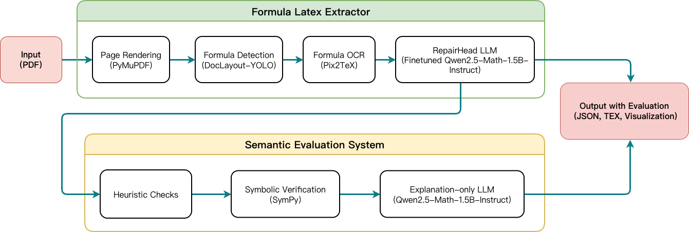

# PDF2TexFormula

**Extract and repair mathematical formulas from raw PDFs into LaTeX.**

**Authors:** Archana Mallick, Ruiying Zhu  

---

## Overview

PDF2TexFormula is a lightweight, modular pipeline that:

1. Detects formulas in full PDFs  
2. Recognizes them with **Pix2TeX** OCR  
3. Repairs LaTeX using an LLM-based repair head  
4. Evaluates semantic correctness with a separate verification head  

This design handles noisy OCR outputs and provides reliable, structured formulas.

---

## Pipeline



[Click here to try the PDF2TexFormula Demo!](https://huggingface.co/spaces/Baiyinyou/PDF2TEX_Formula)

---

## Repository Structure

PDF2LATEXcode/
├── pipeline/ # Core extraction
├── repair/ # LLM-based repair
├── semantic/ # Semantic evaluation
├── utils/ # Utilities
├── pipeline_raw.py # Single-PDF
├── pipeline_raw_many.py # Batch PDFs
├── evaluate_formulas.py
├── test.py
├── test_many.py
└── requirements.txt

---

## Installation

```bash
git clone git@github.com:ar8704ma-s-code/PDF2TexFormula.git
cd PDF2TexFormula/PDF2LATEXcode
python3 -m venv venv
source venv/bin/activate
pip install -r requirements.txt

# Single PDF
python pipeline_raw.py

# Multiple PDFs
python pipeline_raw_many.py

# Evaluate formulas
python evaluate_formulas.py

